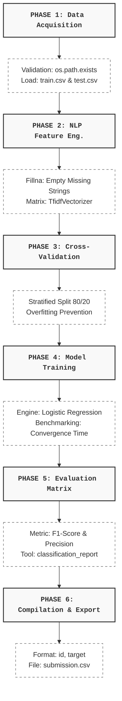

# 🌋 disaster-tweets-nlp

A robust, production-ready Machine Learning pipeline built in Python to predict whether a given tweet is announcing a real-world emergency or using metaphorical language. This project is structured around a highly modular, 6-phase architecture designed for robust text classification and local cross-validation.

---

## 📊 End-to-End Operational Pipeline

The flow chart below illustrates the structural sequence of data transformation through the pipeline. Data moves continuously from raw file ingestion down into an evaluated, formatted Kaggle submission vector.




---

## ⚙️ The 6-Phase Machine Learning Framework

1. **Phase 1: Data Acquisition & Validation**  
   Binds and validates the training and unlabelled verification datasets (`train.csv` / `test.csv`). Features an automated system guardrail that prevents execution if the underlying source arrays are missing.

2. **Phase 2: NLP Text Processing & Feature Engineering**  
   Cleans missing string text variations safely. Utilizes a text tokenization engine (`TfidfVectorizer`) to strip out uninformative filler stop-words and convert raw alpha-numeric characters into high-dimensional numerical feature weights.

3. **Phase 3: Defensive Cross-Validation Setup**  
   Acts as an optimization safety net. Carves out a stratified 20% blind testing split from the training dataset. This tracks true performance metrics locally and prevents the model from overfitting.

4. **Phase 4: Model Training & Hyperparameter Tuning**  
   Initializes and optimizes a regularized linear classification engine (`Logistic Regression`). Implements execution benchmarking to log exact model convergence durations.

5. **Phase 5: Model Evaluation & Metric Breakdown**  
   Calculates model performance against the blind cross-validation dataset. Computes the official Kaggle target evaluation metric (**F1-Score**) alongside complete precision, recall, and classification support matrices.

6. **Phase 6: Submission Compilation & Export**  
   Applies the finalized model weights to the raw test dataset. Maps predictions directly into a rigid structure matching the exact Kaggle leaderboard layout (`id,target`) and writes it out locally to `submission.csv`.

---

## 🚀 Getting Started

### 1. System Requirements & Installation
Ensure you have Python 3.8+ running on your local device. Provision the machine learning environment and external engines by executing:

```bash
pip install pandas numpy scikit-learn openpyxl
```

### 2. Project Workspace Directory Layout
Download the competition dataset from Kaggle and place it inside your workspace to match the structure below:
```text
├── disaster-tweets-nlp/
│   ├── data/
│   │   ├── train.csv         # Hand-classified Kaggle training data
│   │   └── test.csv          # Unlabeled Kaggle validation data
│   ├── .gitignore            # Shields raw datasets and model weights
│   ├── pipeline.py           # Primary 6-Phase ML training script
│   └── README.md             # Project documentation card (This file)
```

### 3. Executing the Pipeline
Run the framework directly from your project directory terminal to train the model and generate your submission file:
```bash
python pipeline.py
```

---

## 🛡️ Security & Git Optimization
This repository enforces clean-room version control practices via an automated `.gitignore` layout configuration. Massive training raw binary files (`data/`), locally compiled output sheets (`submission.csv`), and hidden localized system environments/caches are systematically restricted from publishing to public code repositories.

---

## 📈 Next Milestones
- [ ] Implement custom Regex data cleaning to strip raw URLs and Twitter handles (`@names`) inside Phase 2.
- [ ] Upgrade the text processing matrix from TF-IDF to dense word embeddings (Word2Vec / GloVe).
- [ ] Implement a deep learning architecture using pretrained Transformers (BERT or RoBERTa) to maximize the F1-Score.
